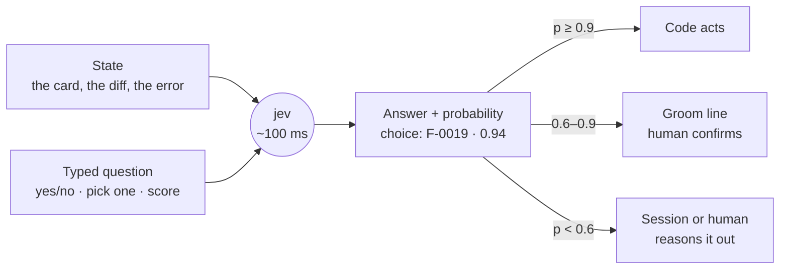
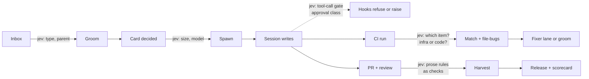
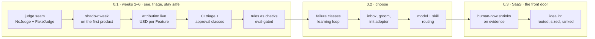

# jev — a cheap judge between code and sessions

Research note, 2026-09-21. Backs the inbox Epic *jev decision model in the tick* in the ASF backlog.
The interactive version with charts is the operator's proposal doc
(https://claude.ai/code/artifact/2564648b-4a57-4767-8f37-b6960d57f105); this file is the record
of what was found and how it was scored, so a card can cite a line.

**The suggestion.** Give ASF a third way to decide — a 100 ms, ~$0.0001 calibrated judgement —
between the code it already trusts and the sessions it already pays for. Short-term (0.1) it
makes the factory *see* (cost per Feature), *triage* (red CI) and *stay safe* (approvals as
code); long-term (0.2 onward) it makes the factory *choose* — which model, which skill, which
card, which rule — with a probability the tick can act on.

---

## 1 · What jev is

[Jev](https://typesafe.ai/blog/introducing-system-one-models-and-jev) is a **decision model**
from TypeSafe AI, not a language model. It takes state plus a typed question and returns a typed
answer with a calibrated probability. It never writes text, so it cannot invent an id, a path or
an option that is not in the question. TypeSafe calls the class "System One"
([docs](https://docs.typesafe.ai/concepts/system-one)); the shorthand that matters here is
**code calculates, jev judges, sessions reason and write.**

| Fact | Value | Source |
|---|---|---|
| Question types | `noul` (yes/no as a 0–1 probability) · `choice` (one of ≤ 255 options, a probability each) · `score` (2–10 ordered levels) | [TypeSafe docs](https://docs.typesafe.ai/concepts/system-one) |
| Input | text only: strings, JSON objects, arrays; several questions per call, evaluated in parallel against one state | same |
| Latency | 70–500 ms end to end, most ~100 ms | [TypeSafe blog](https://typesafe.ai/blog/introducing-system-one-models-and-jev), [Copes](https://flaviocopes.com/jev/) |
| Price | $0.042 per 1M input tokens; output free | [OpenRouter](https://openrouter.ai/typesafe) |
| Vendor benchmark (4 workflows) | jev 67.8 % at $0.0004/case, 0.4 s · Opus 5 73.1 % at $0.176/case, 37.8 s · GPT-5.6 Terra 67.9 % at $0.030, 10.1 s | [DataCamp](https://www.datacamp.com/blog/system-one-models-jev) |
| Calibration | trained with "RLCD"; probabilities optimised against outcomes. Holds across groups of answers, **not per answer** | [TypeSafe docs](https://docs.typesafe.ai/concepts/system-one) |
| Type safety | output is bound to the schema: a malformed value or an option outside the set is impossible; a *wrong* option is not | [DataCamp](https://www.datacamp.com/blog/system-one-models-jev) |
| Status | TypeSafe early access; on OpenRouter as beta since 2026-09-18 through an **alpha** endpoint | [OpenRouter](https://openrouter.ai/~typesafe/jev-latest) |

**Interface.** On OpenRouter it is `POST https://openrouter.ai/api/alpha/decisions`, model
`typesafe/jev-1.13` (pin the version; never `jev-latest`), body `{ model, state, questions }`,
response `{ id: "gen-dec-…", answers, usage: { input_tokens, output_tokens, cost } }`. Context is
32k on OpenRouter, 64k on TypeSafe's native `POST /v1/systemone`. It is absent from
`/api/v1/models`. Python stdlib `urllib` is enough; no SDK
([endpoint notes](https://jevaiguide.com/channels/openrouter/)).

**Where it is already used.** The [Jev lab](https://openrouter.ai/labs/jev) recipes: support
triage (95 messages × 5 questions in 1.2 s for $0.0014), *agent action approval* (4 checks on 24
tool calls, "risky steps stop for a person"), extraction that picks from candidates so it cannot
invent a value. [LangChain](https://www.langchain.com/blog/building-a-harness-with-jev) ships it
as `ModelRouterMiddleware` (fast vs powerful model per request) and `AutoModeMiddleware` (block
risky tool calls before they execute).

**Where it breaks**, per [Copes](https://flaviocopes.com/jev/) and the
[reference gist](https://gist.github.com/pjburnhill/adf8d28efcad9df037bfdece178ef965):
arithmetic and counting, dates in mixed formats, anything that needs generated text, double
negatives and "a property of a property", large state full of irrelevant detail, instructions
that contradict their criteria. It gives **no rationale** — a probability and nothing else.
Every benchmark is the vendor's; TypeSafe acknowledges it cannot prove the pricing is not
subsidised.

---

## 2 · The scoring model

Four questions, each 0–5, that anyone can answer about a candidate use in a minute. Two count
double because they are where the value is: how much of the factory the judgement touches, and
how bad today's answer is.

| Factor | The question | 5 | 3 | 0 |
|---|---|---|---|---|
| **Fit** | A five-second expert judgement with a bounded answer and everything needed in the state? | pick from a list, yes/no | needs some context assembled first | needs reasoning, writing or arithmetic |
| **Reach** ×2 | How much of the factory's work passes through it? | every tool call or event | every card or session | once per product |
| **Gap** ×2 | How poor is today's answer? | nothing, or a regex that misses most | a heuristic right most of the time | a session already does it well |
| **Safety** | Can a wrong answer be made harmless? | advisory or widen-only; a miss costs what it costs today | a wrong answer wastes a session | acts irreversibly or leaks data |

    Score = (Fit + 2·Reach + 2·Gap + Safety) / 30 × 100

Two rules keep it honest: **Fit below 3 scores 0** (not a jev job, however valuable); **Safety
below 2 scores 0** (not allowed, however good the fit). Three bands: **80+ → build in 0.1**;
**60–79 → a card for 0.2**, started in shadow now; **below 60 → leave it to code or a session.**

---

## 3 · The six areas

Best-scoring use per area and horizon. Short-term jev pays where the factory is blind, slow to
triage or reliant on patterns; long-term it reaches the front door.

| Area | Now (0.1) | Later (0.2+) | Today in ASF 0.1 | With jev, short-term | With jev, long-term |
|---|---|---|---|---|---|
| Acceleration | 83 | 70 | a red run files a Bug after two sightings and may launch a fixer; every card takes the same path | infra and flaky failures sorted in 100 ms before a fixer is spawned | the front door routes an idea to the right skill or role with a confidence, asks only when unsure |
| Cost | 90 | 73 | 0 of 218 sessions and 7 of 325 CI runs on the first adopted product are attributed to an item; USD per Feature is empty | every event gets an item with a probability; cost per Feature, Epic, product becomes real | preamble carries the files the card needs; model and effort chosen per job, measured within a day |
| Failures | 83 | 77 | 113 of 166 rules are prose with `enforced: false`; errors become Bugs keyed on an exact signature | a prose rule becomes a runnable `check:` that files a groom line, gated by a must-fire / must-not-fire eval | every error classed into one of the 22 failure classes ([prior art §b](prior-art-prototype.md)); the learning loop proposes per class |
| Right things first | — | 73 | inbox type by regex, parent Epic by title-word overlap, groom answers blank, duplicates by Jaccard | nothing reaches the 80 band; the groom stays human | inbox typed and parented with confidence; groom lines pre-filled; `asf init` adopts a TODO or roadmap into typed cards |
| Security | 83 | 83 | the approval matrix is code, but a hook only recognises the classes its patterns anticipate | an unanticipated action is still classed and raised to `groom` or `human-now`, never lowered | a `human-now` class shrinks only after a quarter without an incident; the judgements stream is the evidence |
| Simplicity | — | 57 | seven bespoke heuristics, each with its own tests | the seam is added, not yet substituted | one `Judge` interface replaces heuristics one at a time, each swap measured |

---

## 4 · Where jev sits in the tick

Nothing new is added to the loop. Every insertion point is a `code` step in `asf/` that already
judges with a regex, a keyword list or a Jaccard score — or launches a session to judge.

Every answer is written to a `metrics/judgements` stream with `product:`, the question id, the
state digest, the model version, the probability, the threshold and what the tick did with it —
the discipline of `metrics/ci` and `metrics/sessions`, and the only substitute for the rationale
jev does not give.

### The uses, scored

| # | Use | Where | Question | Today | Fit | Reach | Gap | Safety | Score | Area |
|---|---|---|---|---|---|---|---|---|---|---|
| 1 | Event → item attribution | `asf.record.match`, `metrics append` | `choice` over the open items in `index.json` from branch, PR title, task name | five rules; 7 of 325 CI and 0 of 218 sessions matched | 5 | 4 | 5 | 4 | **90** | Cost |
| 2 | Red-CI triage | `asf.tick.file_bugs`, the FIXER row | `choice` {infra, flaky, test, code, config} + `noul` "would a rerun pass?" | a step seen twice files a Bug; `Initialize containers` (35 runs) files like a code bug | 5 | 4 | 4 | 4 | **83** | Acceleration |
| 3 | Approval-class recognition | `plugin/hooks`, harvest, the NEEDS line | `choice` over `approvals:` classes for a tool call or diff | pattern rules; an unrecognised action runs as `auto` | 4 | 5 | 3 | 5 | **83** | Security |
| 4 | Prose rules as checks | `asf.rules`, `rules/R-nnnn.md` | `noul` per rule per diff, as the rule's `check:` | 113 of 166 rules `enforced: false` | 4 | 4 | 5 | 3 | **83** | Failures |
| 5 | Tool-call risk gate | `plugin/hooks` PreToolUse | 4 × `noul`: protected path, network, secret path, irreversible | deny-rules and permission modes; harvest holds later | 4 | 5 | 3 | 4 | **80** | Security |
| 6 | Error → failure class | `file-bugs`, the PROPOSED cards | `choice` over the 22 failure classes | Bugs keyed on an exact signature | 4 | 3 | 4 | 5 | 77 | Failures |
| 7 | Preamble file selection | the code-generated preamble | `noul` per candidate file: "does this card touch it?" | the brief cites what the card cites; the session searches for the rest | 3 | 4 | 4 | 3 | 73 | Cost |
| 8 | Inbox type and parent Epic | `asf.groom.inbox` | `choice` {bug, epic, feature}; `choice` over open Epics | regex on `broken\|red\|fails`; Jaccard on title words | 5 | 3 | 3 | 5 | 73 | Right things first |
| 9 | `asf init` adopter typing | the adopter | `choice` {epic, feature, story, task, decision, rule, none} per line | file-name and pattern rules | 4 | 2 | 4 | 5 | 70 | Right things first |
| 10 | Skill and role routing | `plugin/`, `asf idea` | `choice` over `/asf:*` skills and roles, ask below 0.6 | the operator picks | 4 | 3 | 3 | 5 | 70 | Acceleration |
| 11 | Model and effort per job | `asf.workers` spawn | `choice` {haiku, sonnet, opus} + `score` effort from card, size, round | static per role; 88 of 218 sessions on Opus | 3 | 4 | 3 | 3 | 67 | Cost |
| 12 | Groom answer defaults | `groom/<date>.md` | `score` severity, `choice` parent, a suggested rank | `answer: ____` | 3 | 3 | 3 | 5 | 67 | Right things first |
| 13 | Review evidence coverage | REVIEW row | `noul` per acceptance criterion: "is evidence cited?" | the reviewer's table, read by ingest | 3 | 3 | 3 | 4 | 63 | Failures |
| 14 | Near-duplicate cards | `groom_near_duplicates` | `noul` "same work?" per candidate pair | token Jaccard | 4 | 2 | 3 | 5 | 63 | Right things first |
| 15 | Core or product rule split | `asf migrate-epic` | `choice` {core, product}; low confidence → the Opus pass | keyword list, then Opus | 4 | 1 | 3 | 5 | 57 | Simplicity |
| 16 | Interrogator fact or decision | `asf idea` | `noul` "answerable from the repo?" | the interrogator's own judgement | 3 | 3 | 2 | 4 | 57 | Acceleration |
| 17 | Harvest hold triage | the writes-boundary hold | `noul` "incidental path — lockfile, snapshot, generated?" | a human reads the list | 3 | 2 | 3 | 4 | 57 | Failures |
| 18 | Review verdict parsing | `pr_hygiene`, `evidence.verdict_of` | `choice` {approved, changes, none} | regex | 4 | 2 | 2 | 3 | 50 | Simplicity |
| — | Panel dissent, stale, quota guard, waves, trains, scorecard, changelog | `asf.tick.stale`, `asf.metrics`, `worker_pool` | — | arithmetic, or reasoning a session should do | <3 | | | | 0 | — |
| — | Redaction and secret detection | security posture | — | the content must not leave the machine | | | | 0 | 0 | — |

The counts (325 CI events / 7 matched, 218 sessions / 0 matched, 130 Sonnet / 88 Opus, 166 rules /
113 unenforced) are from the first adopted product's record on 2026-09-21. Re-count before a card
cites them.

---

## 5 · Short-term and long-term

A gate is removed only when data earns it. Jev starts in shadow (it answers, the record keeps the
answer, nothing changes) and each use is promoted on its own calibration.

| Horizon | What ships | What it proves | Measured by |
|---|---|---|---|
| 0.1, weeks 1–2 | `asf/judge/` with `NoJudge`, `FakeJudge`, one OpenRouter adapter on `urllib`; `judge:` key per product, off by default; `metrics/judgements` stream | the seam costs nothing when off and tests run with no key | CI green on the fake; `grep -r typesafe asf/` finds only `judge/` |
| 0.1, weeks 2–3 | shadow mode on the first product: attribution, CI triage, approval classes answer into the record only | jev's 0.9s are right nine times in ten on the recorded events | the calibration table from `metrics/judgements` at the first check-in |
| 0.1, weeks 3–6 | attribution live; CI triage before `file-bugs`; approval classes widen-only in hooks; the first ten prose rules as checks, each with a must-fire / must-not-fire eval task | USD per Feature on the scorecard; fewer fixer sessions on infra reds; a prose rule now files a groom line | sessions matched (0 → 90 %+); fixer launches on infra failures (→ 0); rules enforced (53 → 63+) |
| 0.2 | failure classes for the learning loop; inbox typing and parent; groom defaults; `asf init` adopter typing; model and effort per job; skill and role routing | the factory proposes the right cards and picks the right worker | cards accepted without edits; USD per Feature down with fixer rounds flat |
| 0.3 and the SaaS | `human-now` classes shrink on a quarter without incident; the idea front door routes, sizes and ranks with a confidence | autonomy earned per class, not declared | incidents per class per quarter; human touches per Feature |

---

## 6 · Cost and speed of one judgement

A judgement over ~2,000 tokens of state costs about $0.0001 and returns in ~0.1 s. A full day on
one product — every tool call gated, every event attributed, every red run triaged, every diff
checked against ten rules — is on the order of **2,000 judgements, or $0.20**. The comparison
that matters is jev against the session ASF launches today to make the same call.

| Who judges | Cost per judgement | Time | Gives a reason | Can invent an answer |
|---|---|---|---|---|
| code (regex, Jaccard) | $0 | ms | no | no — but misses what it did not anticipate |
| jev via OpenRouter | ~$0.0001 | 0.1–0.5 s | no — a probability | no — output is bound to the options given |
| a Sonnet session (median ~8 min) | $0.05–0.50 | minutes | yes | yes |
| an Opus session | $0.20–2.00 | minutes | yes | yes |

Session costs are estimates from `metrics/sessions` minutes (the USD column is null until the
pricing table lands). The vendor benchmark puts jev 440× cheaper and 95× faster than Opus 5 at
67.8 % versus 73.1 % accuracy; those are vendor numbers, and the shadow week produces ours.

---

## 7 · Guardrails — secure and simple by construction

- **Off by default, per product.** `judge:` in `~/.ASF/products/
.yaml`; a product with
  customer data leaves it off. `NoJudge` is a real answer, like the `fake` worker runtime: every
  call site's fallback is exactly today's behaviour.
- **Widen-only, everywhere.** Jev may raise an action to `groom` or `human-now`, strip a default,
  or add a groom line. It never lowers an approval class, merges, closes, or acts irreversibly on
  a probability.
- **State is the minimal slice, redacted first.** A tool-call question sees the command, not the
  transcript; an attribution question sees branch, title and the item list, not the diff.
  Everything passes redaction before it leaves the machine, and redaction itself never uses jev —
  the thing being judged is the thing that must not leave.
- **Recorded, replayable.** Every judgement is a `metrics/judgements` event: `product:`, question
  id, state digest, model version, probability, threshold, outcome. Calibration evidence and
  audit trail in one stream.
- **Evals before trust.** Every question is a fixed string under `asf/judge/questions/`; every
  judging use gets must-fire / must-not-fire tasks in `evals/`. A question with no eval task
  cannot be promoted out of shadow.
- **One vendor behind an interface.** `Judge` is the seam; `typesafe_openrouter` is one adapter;
  the alpha endpoint is pinned to `typesafe/jev-1.13`. A judge error is logged and degrades to
  `NoJudge` for the rest of the tick — never a halted line.
- **Named in the threat model.** SECURITY.md says what leaves the machine, to whom, and how to
  turn it off. Retention, a DPA and determinism are questions for TypeSafe before any customer
  product turns it on.
- **Simplicity is the long game.** Each heuristic jev replaces is one fewer special case in
  `asf/` — but only after the swap is measured. Until then jev is an addition, and the honest
  simplicity score is modest.

### Open questions

- Does TypeSafe offer a data-processing agreement or a no-retention flag?
- Is a jev answer deterministic for identical `state` + `questions`? If yes, the judgements
  stream is replayable and the missing rationale matters less.
- Does `tools/forbidden-names.txt` need an entry? `typesafe` and `jev` belong in `asf/judge/`
  and operator config, nowhere else in `asf/`.

---

## Sources

- [Introducing System One Models & Jev](https://typesafe.ai/blog/introducing-system-one-models-and-jev) — TypeSafe AI, 2026-09-21 · [System One docs](https://docs.typesafe.ai/concepts/system-one)
- [Jev on OpenRouter](https://openrouter.ai/~typesafe/jev-latest) · [Jev Lab](https://openrouter.ai/labs/jev) · [announcement](https://x.com/OpenRouter/status/2100744709589316009) · [endpoint and payloads](https://jevaiguide.com/channels/openrouter/)
- [TypeSafe Jev — project knowledge gist](https://gist.github.com/pjburnhill/adf8d28efcad9df037bfdece178ef965) · [A deep dive into Jev](https://flaviocopes.com/jev/) · [Building a harness with Jev](https://www.langchain.com/blog/building-a-harness-with-jev) · [DataCamp on Jev](https://www.datacamp.com/blog/system-one-models-jev)
- ASF 0.1: the operator's plan of 2026-09-21; this repository at `fe367f8` — `asf/record/match.py`, `asf/groom/`, `asf/tick/file_bugs.py`, `asf/rules/rules.py`, `docs/products.example.yaml`, [ADR 0001](../decisions/0001-prior-art-not-base.md), [prior art](prior-art-prototype.md)
- The first adopted product's record: `metrics/ci`, `metrics/sessions`, `rules/` — counted 2026-09-21
